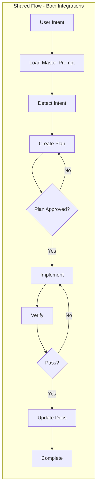
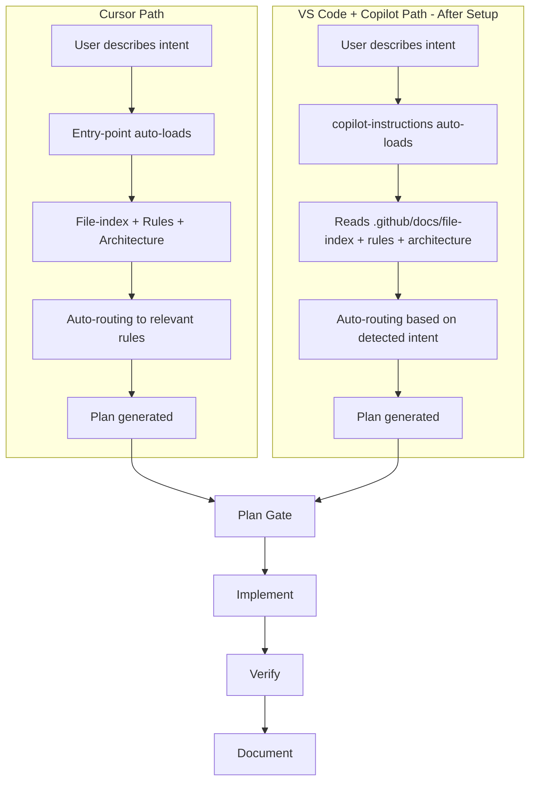
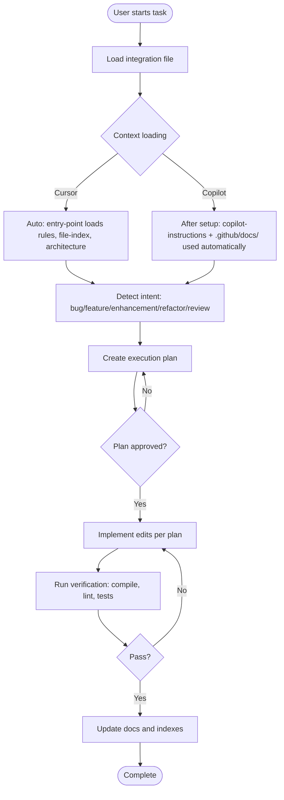

# Cursor Automation Files

Reusable master prompts and integration specs for AI-assisted development in **Cursor** and **Visual Studio Code + GitHub Copilot**. These files help you get consistent, high-quality AI assistance by standardizing how you plan, implement, verify, and document code changes.

---

## Table of Contents

- [What This Repository Provides](#what-this-repository-provides)
- [Expected Outcomes & Business Value](#expected-outcomes--business-value)
- [Key Concepts (In Plain English)](#key-concepts-in-plain-english)
- [Which File to Use](#which-file-to-use)
- [Quick Start](#quick-start)
- [Core Logic Flow](#core-logic-flow)
- [Recommended Workflow](#recommended-workflow)
- [How to Use Each Integration File](#how-to-use-each-integration-file)
- [File Map](#file-map)
- [Maintenance](#maintenance)
- [Cross-Project Usage](#cross-project-usage)
- [Migration: Cursor ↔ VS Code + Copilot](#migration-cursor--vs-code--copilot)
- [Tips for Success](#tips-for-success)
- [Common Questions](#common-questions)

---

## What This Repository Provides

This repository contains two master prompt files that act as "instruction manuals" for AI coding assistants. Instead of explaining your project and workflow every time you start a new chat, you reference one of these files and the AI follows a structured process.

<!-- markdownlint-disable MD060 -->
| File | Purpose |
|------|---------|
| **CURSOR_INTEGRATION.mdc** | For Cursor users. Uses an entry-point that auto-loads rules, file indexes, and architecture docs. You describe what you need; the system routes automatically. |
| **VSCODE_COPILOT_INTEGRATION.mdc** | For VS Code + GitHub Copilot users. Same structure as Cursor: `.github/docs/` (architecture, file-index, rules, debugging, maintenance). After setup, you just prompt—file-index and rules used automatically. |
<!-- markdownlint-enable MD060 -->

**Shared concepts** in both files:

- **Hard-gated TDD planning contract** – No implementation starts unless the plan includes `Behavior Test Matrix (Success/Error/Edge)`, `Code-Fact Evidence`, `Verification Commands`, and `Open Preference Decisions (only if needed)`.
- **Quality gates** – Compile, lint, and pattern checks run after implementation.
- **Project detection** – The AI analyzes your codebase to adapt to frontend, backend, full-stack, monorepo, etc.
- **File specifications** – Full structure: architecture (8–10 files), file-index (6–9 files), debugging (4 files), rules (7 files), maintenance (3 files).
- **Evidence-first precision** – Plans must cite concrete repo facts (paths/symbols/current behavior) and avoid guess/theory/hypothesis-based steps.
- **When to ask questions** – Ask only after best evidence-based options are preselected; questions should be developer preference/tradeoff decisions, not discoverable code facts.
- **Web verification rule** – Use web verification when facts are external, time-variant, or unavailable from repository evidence.
- **Update triggers** – When and how to update documentation when code changes (component→components-index, hook→hooks-index, etc.).

**How to use**: Copy the relevant file into your project and reference it when starting AI-assisted workflows.

---

## Expected Outcomes & Business Value

Research shows that structured prompts (plan-first, context-aware, rule-grounded) tend to improve AI code generation quality compared to ad-hoc prompting. When implemented as intended, these integration files typically deliver:

<!-- markdownlint-disable MD060 -->
| Aspect | With Integration | Ad-hoc prompting |
|--------|------------------|------------------|
| **Plan adherence** | Plan gate ensures edits match intent; drift is caught early | Edits often diverge; more back-and-forth |
| **Context accuracy** | File-index and architecture keep AI grounded in your codebase | AI guesses file locations; more wrong-file edits |
| **Rework cycles** | Fewer—plan approval reduces trial-and-error | More—implement-first leads to redo loops |
| **Onboarding** | New devs (and AI) get consistent workflow and docs | Each session starts from scratch |
| **Maintenance** | Update triggers keep docs in sync with code | Docs drift; AI uses stale context |
<!-- markdownlint-enable MD060 -->

**Business impact**: Teams typically see faster iteration (less rework), fewer "AI went off-track" moments, and better consistency across sessions. Results vary by project size, team discipline, and how well docs are kept up to date.

---

## Key Concepts (In Plain English)

<!-- markdownlint-disable MD060 -->
| Term | What It Means |
|------|---------------|
| **Master prompt** | A document that tells the AI how to behave for your project: what to plan, how to implement, and how to verify. |
| **Entry-point** | (Cursor only) `.cursor/rules/entry-point.mdc`—the detailed workflow. `AGENTS.md` is the reliable trigger (short pointer: "Load @.cursor/rules/entry-point.mdc first"). Both ensure it's used. |
| **Plan gate** | A checkpoint: no code edits until you approve a written plan with exact files and edits. |
| **Planning contract** | The plan must include: file list, code snippets (before/after), reasons, and verification steps. |
| **Auto-routing** | (Cursor only) The system figures out which rules and docs apply to your request without you specifying them. |
| **copilot-instructions.md** | (VS Code) `.github/copilot-instructions.md` auto-loads for every chat. Instructs AI to read `.github/docs/` (file-index, rules, architecture). Same behavior as Cursor entry-point. |
| **File-index** | A catalog of your project’s files (components, hooks, routes, etc.) so the AI knows where things live. |
| **Quality gates** | Automated checks (compile, lint, tests) that run after changes to catch errors early. |
<!-- markdownlint-enable MD060 -->

---

## Which File to Use

<!-- markdownlint-disable MD060 -->
| Use Case                                             | File                            |
| ---------------------------------------------------- | ------------------------------- |
| Developing in **Cursor**                             | `CURSOR_INTEGRATION.mdc`        |
| Developing in **VS Code** with **GitHub Copilot**     | `VSCODE_COPILOT_INTEGRATION.mdc` |
<!-- markdownlint-enable MD060 -->

**Same core principles in both**:

- Plan before implementing.
- Plans must be fact-based (grounded in existing code).
- Plans must be behavior-first TDD scoped for success, error, and edge cases.
- Follow approved plans strictly.
- Run quality checks after changes.

**Main difference**: How context and rules are loaded.

- **Cursor**: Entry-point auto-loads rules and file indexes; you describe intent and the system routes automatically.
- **VS Code + Copilot**: After one-time setup, `.github/copilot-instructions.md` auto-loads—you just prompt. Before setup, reference the integration file.

---

## Quick Start

### Cursor

**Prerequisites**: Cursor IDE installed.

1. Copy `CURSOR_INTEGRATION.mdc` to `.cursor/` in your project (or keep at root).
2. **If you have a full `.cursor/` setup**: The entry-point at `.cursor/rules/entry-point.mdc` (with `alwaysApply: true`) and `AGENTS.md` ensure it is used in every chat. If not auto-applied, type `@.cursor/rules/entry-point.mdc` at the start of each new chat.
3. **If you only have the integration file**: Reference `@CURSOR_INTEGRATION.mdc` and ask the AI to analyze the codebase and follow its specifications.
4. Describe what you need in plain language. The AI will detect intent, load context, and produce a plan.
5. Approve the plan, then let the AI implement, verify, and update docs.

### Visual Studio Code + GitHub Copilot

**Prerequisites**: VS Code and a GitHub account with Copilot access.

**One-time setup** (same structure as Cursor—architecture, file-index, rules, etc.):

1. Install [VS Code](https://code.visualstudio.com/) and the [GitHub Copilot](https://marketplace.visualstudio.com/items?itemName=GitHub.copilot) extension. Sign in.
2. Copy `VSCODE_COPILOT_INTEGRATION.mdc` to your project.
3. Open Copilot Chat (`Ctrl+Shift+I` / `Cmd+Shift+I`), reference `@VSCODE_COPILOT_INTEGRATION.mdc`, and prompt: **"Analyze the entire codebase and regenerate all .github/ files according to the specifications in this document. Follow Project Detection & Adaptation first. Create .github/copilot-instructions.md and the full .github/docs/ structure (architecture/, file-index/, debugging/, rules/, maintenance/). Generate only files that apply to the detected project type."**
4. The AI creates the full structure. Done.

**After setup**: Open Copilot Chat and describe what you need. No `@` references required. The AI will detect intent, find files via file-index, apply rules, create a plan, and guide you through implementation—same as Cursor.

---

## Core Logic Flow

Both integration files share the same execution flow but differ in how context is loaded. The diagrams below show the shared flow and the two context-loading paths.

### Shared Execution Flow



### Context Loading: Cursor vs VS Code + Copilot

After setup, both work the same way. Before setup, Copilot requires explicit references.



### End-to-End Flow



---

## Recommended Workflow

Both integrations follow the same four-phase workflow. Each phase has a clear purpose and output.

### Phase 1: Plan

**Goal**: Produce a concrete execution plan before any code changes.

**The plan must include**:

- Exact file list to update
- Exact code sections and before/after snippets
- Reason for every edit
- Behavior Test Matrix: success, error, and edge cases
- Code-Fact Evidence: exact paths/symbols/current behavior grounded in repo evidence
- Verification steps (commands to run)
- Open Preference Decisions (only if needed, after preselecting best evidence-based options)
- Any doc or index updates needed

**Hard gate**: If any required section is missing, implementation must not start.

**Why this matters**: Behavior-first, evidence-grounded plans reduce hallucinations and keep changes focused. You can review and adjust before anything is modified.

**Plan quality examples**:

- Acceptable: "Success/error/edge tests defined from user-visible behavior, cites `src/auth/login.ts` and `tests/auth/login.spec.ts`, includes exact verification commands."
- Unacceptable: "High-level implementation idea with no test matrix, no repo evidence, and guesses about internals."

### Phase 2: Implement

**Goal**: Apply edits strictly according to the approved plan.

**Tips**:

- For simple changes (1–3 files): Implement the full plan in one go.
- For complex changes (many files, breaking changes): Implement step by step and verify between steps.
- If the code has drifted from the plan, pause and request a revised step instead of guessing.

### Phase 3: Verify

**Goal**: Confirm the changes work and follow project patterns.

**Typical checks**:

- Compile or type-check (e.g., `tsc`, `go build`)
- Lint (e.g., ESLint, Pylint)
- Run tests
- Confirm pattern compliance (naming, structure, imports)

### Phase 4: Document

**Goal**: Keep docs in sync with code.

**When to update** (see Update Triggers in each integration file):

- **New files**: Component→components-index+src-index; Hook→hooks-index+src-index; Route→routes-index+src-index; Store→stores-index+src-index; Controller→controllers-index+src-index; Service→services-index+src-index; Model→models-index+src-index; Utility→utils-index+src-index
- **New features or patterns** → Update architecture docs (module-structure, routing, state-management, etc.)
- **Breaking changes** → Update overview, tech-stack, add to common-issues if migration needed
- **Bug fixes** → Add to common-issues if it's a recurring problem

---

## How to Use Each Integration File

### Using CURSOR_INTEGRATION.mdc

**Best for**: Cursor users who want automated AI assistance with minimal manual context loading.

**When to use**: You develop in Cursor and want the system to auto-load rules, file indexes, and architecture docs based on your intent.

**Step-by-step**:

1. Copy `CURSOR_INTEGRATION.mdc` into your project (e.g. `.cursor/` or project root).
2. **If you have a full `.cursor/` setup**: `.cursor/rules/entry-point.mdc` (with `alwaysApply: true`) and `AGENTS.md` ensure the entry-point is used. If not auto-applied, type `@.cursor/rules/entry-point.mdc` at chat start.
3. **If you only have the integration file**: Reference `@CURSOR_INTEGRATION.mdc` explicitly.
4. Describe what you need in plain language. The system detects intent (bug, feature, enhancement, refactor, review).
5. The AI automatically loads relevant rules, file-indexes, and architecture docs.
6. Review the execution plan. Approve it when ready.
7. Let the AI implement, verify, and update docs.

**Example prompt**:

```text
@CURSOR_INTEGRATION.mdc

I need to add pagination to the user list component. The API returns total count and page size.
```

**Regenerating `.cursor/` files**:

```text
Analyze the codebase and regenerate all .cursor/ files according to @CURSOR_INTEGRATION.mdc
```

**Notes**: You do not need to reference command files or rules manually; the entry-point routes automatically.

---

### Using VSCODE_COPILOT_INTEGRATION.mdc

**Best for**: VS Code + GitHub Copilot users who want the same experience as Cursor—full architecture, file-index, rules, and "just prompt" workflow.

**One-time setup**:

1. Copy `VSCODE_COPILOT_INTEGRATION.mdc` into your project.
2. Open Copilot Chat, reference `@VSCODE_COPILOT_INTEGRATION.mdc`, and prompt: **"Analyze the entire codebase and regenerate all .github/ files according to the specifications in this document. Follow Project Detection & Adaptation first. Create .github/copilot-instructions.md and the full .github/docs/ structure (architecture/, file-index/, debugging/, rules/, maintenance/). Generate only files that apply to the detected project type."**
3. The AI creates the full structure. VS Code will auto-load `.github/copilot-instructions.md` for every chat.

**After setup—just prompt**:

1. Open Copilot Chat (`Ctrl+Shift+I` / `Cmd+Shift+I`).
2. Describe what you need. No `@` references required.
3. The AI will detect intent, find files via file-index, apply rules, create a plan, and guide you through implementation and verification—same as Cursor.

**Example prompts** (after setup):

```text
Add pagination to the user list component. The API returns total count and page size.
```

```text
Fix the login form validation bug—the email field accepts invalid formats.
```

```text
Refactor the API client to use fetch instead of axios.
```

**Notes**: After setup, `.github/copilot-instructions.md` is auto-loaded and instructs the AI to use `.github/docs/` (file-index, architecture, rules) for file discovery and rule application. Same behavior as Cursor's entry-point. When adding or modifying files, prompt the AI to update the relevant indexes per the Update Triggers.

---

## File Map

```text
cursor-automation-files/
├── README.md                      # This file – onboarding and usage
├── CURSOR_INTEGRATION.mdc         # Cursor master prompt (entry-point, .cursor/ structure)
└── VSCODE_COPILOT_INTEGRATION.mdc  # VS Code + Copilot master prompt (full structure same as Cursor)
```

### CURSOR_INTEGRATION.mdc

<!-- markdownlint-disable MD060 -->
| Attribute | Details |
|-----------|---------|
| **Audience** | Cursor users |
| **Assumes** | `.cursor/` directory, entry-point, file-index, rules, commands |
| **Setup** | May use `bun run scripts/setup-cursor-integration.ts` if available in your project |
| **Workflow** | Entry-point-first; auto-routing to rules and file-index |
<!-- markdownlint-enable MD060 -->

### VSCODE_COPILOT_INTEGRATION.mdc

<!-- markdownlint-disable MD060 -->
| Attribute | Details |
|-----------|---------|
| **Audience** | VS Code + GitHub Copilot users |
| **Assumes** | VS Code, Copilot extension; after setup: `.github/docs/` (same structure as `.cursor/`) |
| **Setup** | One-time: prompt AI to regenerate all `.github/` files (copilot-instructions + full docs structure) |
| **Workflow** | After setup: just prompt; same as Cursor—file-index, rules, architecture used automatically |
<!-- markdownlint-enable MD060 -->

---

## Maintenance

### When to Update Integration Files

Update the integration files themselves when:

- **New project types** – Add detection and adaptation guidance.
- **New workflow patterns** – Update the planning contract or automation levels.
- **Breaking changes** – Document migration steps in the relevant file.

### When to Update Project Documentation (per integration spec)

Update your project’s docs (file-index, architecture, etc.) when:

- **New files** – Update file-index (components, hooks, routes, controllers, services, models, utils).
- **New features** – Update architecture docs (module-structure, routing, state, etc.).
- **Breaking changes** – Update overview, tech-stack, and common-issues.

See the **Update Triggers & Maintenance** section in each integration file for more detail.

---

## Cross-Project Usage

Both integration files are designed to work across project types: frontend, backend, full-stack, mobile, CLI. They include:

- **Project detection** – Type, tech stack, monorepo structure
- **Adaptive file specifications** – Architecture, file-index, rules
- **Update triggers** – When and how to keep documentation in sync

**To use in a new project**: Copy the relevant file into the project and prompt the AI to analyze the codebase and adapt accordingly.

---

## Migration: Cursor ↔ VS Code + Copilot

If you switch editors, use the **Migration Map** in `VSCODE_COPILOT_INTEGRATION.mdc` to translate concepts:

<!-- markdownlint-disable MD060 -->
| Cursor                         | VS Code + Copilot                    |
| ------------------------------ | ------------------------------------ |
| `@.cursor/rules/entry-point.mdc`     | `@VSCODE_COPILOT_INTEGRATION.mdc`    |
| Auto-context from file-index   | Explicit `@file` or path references  |
| Auto-routing to rules          | Explicit rule references in prompts  |
| Cursor Composer                | Copilot Chat + Inline Chat           |
| `.cursor/` (architecture, file-index, rules) | `.github/docs/` (same structure) |
| Just describe intent           | Same after setup; copilot-instructions + docs auto-used |
<!-- markdownlint-enable MD060 -->

---

## Tips for Success

1. **Run setup first** – For Cursor, use the setup script or regenerate `.cursor/`. For Copilot, prompt the AI to regenerate all `.github/` files. Full structure enables "just prompt" workflow.
2. **Never skip the plan** – Approve a concrete plan before any code edits. It reduces errors and keeps changes focused.
3. **Be specific about intent** – "Add pagination to the user list" is better than "improve the list." Specificity improves plan quality.
4. **Verify after changes** – Run compile, lint, and tests. Don’t assume the AI got everything right.
5. **After setup, just prompt** – Both Cursor and Copilot use file-index and rules automatically. No need to reference files or rules manually.
6. **For complex changes: go step by step** – Approve and implement one phase at a time instead of the full plan in one shot.
7. **Update docs when code changes** – Prompt the AI to update file-index and architecture per the Update Triggers. Keeps future prompts accurate.

---

## Common Questions

**Q: Do I need both files?**  
A: No. Use the one that matches your editor (Cursor or VS Code + Copilot).

**Q: Can I use these in a new project without a `.cursor/` folder?**  
A: Yes. For Cursor, reference `CURSOR_INTEGRATION.mdc` directly. For Copilot, reference `VSCODE_COPILOT_INTEGRATION.mdc`. The AI will adapt to your project structure.

**Q: What if the AI suggests edits that don’t match the plan?**  
A: Pause and ask for a revised step. The integration files specify: if code drifts from the plan, stop and request approval before continuing.

**Q: How do I know which rules apply to my request?**  
A: After setup, both auto-route: the AI detects intent (bug/feature/enhancement/refactor/review) and applies the relevant rules automatically. Before Copilot setup, reference `@VSCODE_COPILOT_INTEGRATION.mdc` and use the prompt templates.

**Q: Are these files only for JavaScript/TypeScript projects?**  
A: No. They support frontend, backend, full-stack, mobile, and CLI projects. Project detection adapts to your stack (React, Vue, Python, Go, etc.).

---

## License

See repository license file if present.
