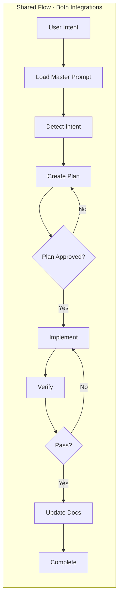
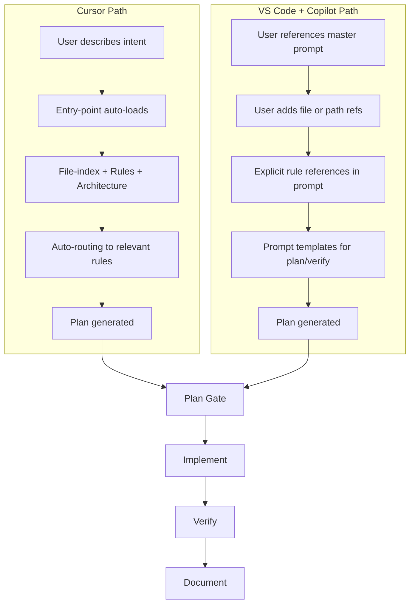
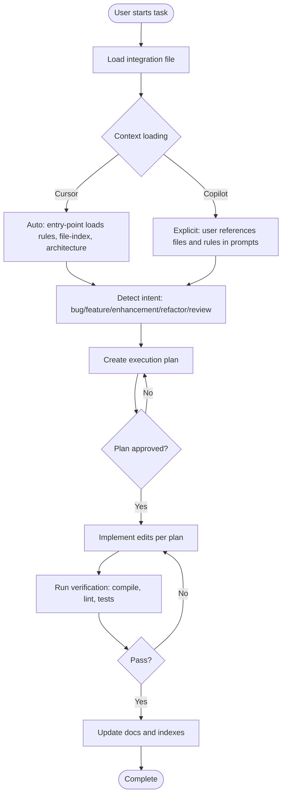

# Cursor Automation Files

Reusable master prompts and integration specs for AI-assisted development in **Cursor** and **Visual Studio Code + GitHub Copilot**. These files help you get consistent, high-quality AI assistance by standardizing how you plan, implement, verify, and document code changes.

---

## Table of Contents

- [What This Repository Provides](#what-this-repository-provides)
- [Key Concepts (In Plain English)](#key-concepts-in-plain-english)
- [Which File to Use](#which-file-to-use)
- [Quick Start](#quick-start)
- [Core Logic Flow](#core-logic-flow)
- [Recommended Workflow](#recommended-workflow)
- [How to Use Each Integration File](#how-to-use-each-integration-file)
- [File Map](#file-map)
- [Maintenance](#maintenance)
- [Cross-Project Usage](#cross-project-usage)
- [Migration: Cursor ↔ VS Code + Copilot](#migration-cursor--vs-code--copilot)
- [Tips for Success](#tips-for-success)
- [Common Questions](#common-questions)

---

## What This Repository Provides

This repository contains two master prompt files that act as "instruction manuals" for AI coding assistants. Instead of explaining your project and workflow every time you start a new chat, you reference one of these files and the AI follows a structured process.

<!-- markdownlint-disable MD060 -->
| File | Purpose |
|------|---------|
| **CURSOR_INTEGRATION.mdc** | For Cursor users. Uses an entry-point that auto-loads rules, file indexes, and architecture docs. You describe what you need; the system routes automatically. |
| **VSCODE_COPILOT_INTEGRATION.mdc** | For VS Code + GitHub Copilot users. Uses explicit prompt orchestration. You reference the file and add context (files, rules) as needed. |
<!-- markdownlint-enable MD060 -->

**Shared concepts** in both files:

- **Planning contract** – A plan must list exact files, edits, and verification steps before any code changes.
- **Quality gates** – Compile, lint, and pattern checks run after implementation.
- **Project detection** – The AI analyzes your codebase to adapt to frontend, backend, full-stack, etc.
- **File specifications** – Guidance for architecture docs, file indexes, and rules.
- **Maintenance triggers** – When and how to update documentation when code changes.

**How to use**: Copy the relevant file into your project and reference it when starting AI-assisted workflows.

---

## Key Concepts (In Plain English)

<!-- markdownlint-disable MD060 -->
| Term | What It Means |
|------|---------------|
| **Master prompt** | A document that tells the AI how to behave for your project: what to plan, how to implement, and how to verify. |
| **Entry-point** | (Cursor only) The first file you load. It automatically pulls in rules, file indexes, and docs based on your request. |
| **Plan gate** | A checkpoint: no code edits until you approve a written plan with exact files and edits. |
| **Planning contract** | The plan must include: file list, code snippets (before/after), reasons, and verification steps. |
| **Auto-routing** | (Cursor only) The system figures out which rules and docs apply to your request without you specifying them. |
| **Explicit orchestration** | (Copilot) You must tell the AI which files and rules to use; it does not auto-load context. |
| **File-index** | A catalog of your project’s files (components, hooks, routes, etc.) so the AI knows where things live. |
| **Quality gates** | Automated checks (compile, lint, tests) that run after changes to catch errors early. |
<!-- markdownlint-enable MD060 -->

---

## Which File to Use

<!-- markdownlint-disable MD060 -->
| Use Case                                             | File                            |
| ---------------------------------------------------- | ------------------------------- |
| Developing in **Cursor**                             | `CURSOR_INTEGRATION.mdc`        |
| Developing in **VS Code** with **GitHub Copilot**     | `VSCODE_COPILOT_INTEGRATION.mdc` |
<!-- markdownlint-enable MD060 -->

**Same core principles in both**:

- Plan before implementing.
- Plans must be fact-based (grounded in existing code).
- Follow approved plans strictly.
- Run quality checks after changes.

**Main difference**: How context and rules are loaded.

- **Cursor**: Entry-point auto-loads rules and file indexes; you describe intent and the system routes automatically.
- **VS Code + Copilot**: You explicitly reference the master prompt and add file/rule context in your prompts; Copilot does not auto-load.

---

## Quick Start

### Cursor

**Prerequisites**: Cursor IDE installed.

1. Copy `CURSOR_INTEGRATION.mdc` to `.cursor/` in your project (or keep at root).
2. **If you have a full `.cursor/` setup**: Start every new chat with `@.cursor/entry-point.mdc` as the first context.
3. **If you only have the integration file**: Reference `@CURSOR_INTEGRATION.mdc` and ask the AI to analyze the codebase and follow its specifications.
4. Describe what you need in plain language. The AI will detect intent, load context, and produce a plan.
5. Approve the plan, then let the AI implement, verify, and update docs.

### Visual Studio Code + GitHub Copilot

**Prerequisites**: VS Code and a GitHub account with Copilot access.

1. Install [VS Code](https://code.visualstudio.com/) and the [GitHub Copilot](https://marketplace.visualstudio.com/items?itemName=GitHub.copilot) extension.
2. Sign in with your GitHub account in VS Code.
3. Copy `VSCODE_COPILOT_INTEGRATION.mdc` to your project root or a docs folder.
4. Open Copilot Chat: `Ctrl+Shift+I` (Windows/Linux) or `Cmd+Shift+I` (macOS).
5. Reference the file: `@VSCODE_COPILOT_INTEGRATION.mdc`
6. Describe your task and ask for a plan first. After approval, ask for implementation and verification.

---

## Core Logic Flow

Both integration files share the same execution flow but differ in how context is loaded. The diagrams below show the shared flow and the two context-loading paths.

### Shared Execution Flow



### Context Loading: Cursor vs VS Code + Copilot



### End-to-End Flow



---

## Recommended Workflow

Both integrations follow the same four-phase workflow. Each phase has a clear purpose and output.

### Phase 1: Plan

**Goal**: Produce a concrete execution plan before any code changes.

**The plan must include**:

- Exact file list to update
- Exact code sections and before/after snippets
- Reason for every edit
- Verification steps (commands to run)
- Any doc or index updates needed

**Why this matters**: Plans grounded in existing code reduce hallucinations and keep changes focused. You can review and adjust before anything is modified.

### Phase 2: Implement

**Goal**: Apply edits strictly according to the approved plan.

**Tips**:

- For simple changes (1–3 files): Implement the full plan in one go.
- For complex changes (many files, breaking changes): Implement step by step and verify between steps.
- If the code has drifted from the plan, pause and request a revised step instead of guessing.

### Phase 3: Verify

**Goal**: Confirm the changes work and follow project patterns.

**Typical checks**:

- Compile or type-check (e.g., `tsc`, `go build`)
- Lint (e.g., ESLint, Pylint)
- Run tests
- Confirm pattern compliance (naming, structure, imports)

### Phase 4: Document

**Goal**: Keep docs in sync with code.

**When to update**:

- New files → Update file-index (components, hooks, routes, etc.)
- New features or patterns → Update architecture docs
- Bug fixes → Add to common-issues if it’s a recurring problem

---

## How to Use Each Integration File

### Using CURSOR_INTEGRATION.mdc

**Best for**: Cursor users who want automated AI assistance with minimal manual context loading.

**When to use**: You develop in Cursor and want the system to auto-load rules, file indexes, and architecture docs based on your intent.

**Step-by-step**:

1. Copy `CURSOR_INTEGRATION.mdc` into your project (e.g. `.cursor/` or project root).
2. **If you have a full `.cursor/` setup**: Start every new chat with `@.cursor/entry-point.mdc` as the first context.
3. **If you only have the integration file**: Reference `@CURSOR_INTEGRATION.mdc` explicitly.
4. Describe what you need in plain language. The system detects intent (bug, feature, enhancement, refactor, review).
5. The AI automatically loads relevant rules, file-indexes, and architecture docs.
6. Review the execution plan. Approve it when ready.
7. Let the AI implement, verify, and update docs.

**Example prompt**:

```text
@CURSOR_INTEGRATION.mdc

I need to add pagination to the user list component. The API returns total count and page size.
```

**Regenerating `.cursor/` files**:

```text
Analyze the codebase and regenerate all .cursor/ files according to @CURSOR_INTEGRATION.mdc
```

**Notes**: You do not need to reference command files or rules manually; the entry-point routes automatically.

---

### Using VSCODE_COPILOT_INTEGRATION.mdc

**Best for**: VS Code + GitHub Copilot users who want structured planning and implementation with explicit control over context.

**When to use**: You develop in VS Code with Copilot and prefer to specify which files and rules the AI should use.

**Step-by-step**:

1. Copy `VSCODE_COPILOT_INTEGRATION.mdc` into your project root or docs folder.
2. Open Copilot Chat: `Ctrl+Shift+I` (Windows/Linux) or `Cmd+Shift+I` (macOS).
3. Start every new workflow by referencing the file: `@VSCODE_COPILOT_INTEGRATION.mdc`
4. **Planning phase**: Ask for an execution plan with exact files, edits, and verification steps.
5. Review and approve the plan before any edits.
6. **Implementation phase**: Ask Copilot to apply the plan—one step at a time for complex changes, or the full plan for simple ones.
7. **Verification phase**: Run compile, lint, and tests; confirm the changes match the plan.

**Example prompts**:

**Planning**:

```text
@VSCODE_COPILOT_INTEGRATION.mdc

I need to add pagination to the user list component. Following the Planning Contract, produce an execution plan with exact files, before/after snippets, and verification steps.
```

**Implementation** (after plan approved):

```text
Here is the approved plan: [paste plan]. Implement step 1 only.
```

**Verification**:

```text
Run verification: compile, lint, and confirm we follow project patterns.
```

**Notes**: Copilot does not auto-load rules or file-indexes. Include relevant file paths or `@file` references when you need context. Use the prompt templates in the integration file for planning, implementation, and verification.

---

## File Map

```text
cursor-automation-files/
├── README.md                      # This file – onboarding and usage
├── CURSOR_INTEGRATION.mdc         # Cursor master prompt (entry-point, .cursor/ structure)
└── VSCODE_COPILOT_INTEGRATION.mdc  # VS Code + Copilot master prompt (prompt-first, plan-before-implement)
```

### CURSOR_INTEGRATION.mdc

<!-- markdownlint-disable MD060 -->
| Attribute | Details |
|-----------|---------|
| **Audience** | Cursor users |
| **Assumes** | `.cursor/` directory, entry-point, file-index, rules, commands |
| **Setup** | May use `bun run scripts/setup-cursor-integration.ts` if available in your project |
| **Workflow** | Entry-point-first; auto-routing to rules and file-index |
<!-- markdownlint-enable MD060 -->

### VSCODE_COPILOT_INTEGRATION.mdc

<!-- markdownlint-disable MD060 -->
| Attribute | Details |
|-----------|---------|
| **Audience** | VS Code + GitHub Copilot users |
| **Assumes** | VS Code, Copilot extension, explicit prompt orchestration |
| **Setup** | Manual; no scripts required |
| **Workflow** | Prompt-first; explicit rule and file references; plan-before-implement |
<!-- markdownlint-enable MD060 -->

---

## Maintenance

### When to Update Integration Files

Update the integration files themselves when:

- **New project types** – Add detection and adaptation guidance.
- **New workflow patterns** – Update the planning contract or automation levels.
- **Breaking changes** – Document migration steps in the relevant file.

### When to Update Project Documentation (per integration spec)

Update your project’s docs (file-index, architecture, etc.) when:

- **New files** – Update file-index (components, hooks, routes, controllers, services, models, utils).
- **New features** – Update architecture docs (module-structure, routing, state, etc.).
- **Breaking changes** – Update overview, tech-stack, and common-issues.

See the **Update Triggers & Maintenance** section in each integration file for more detail.

---

## Cross-Project Usage

Both integration files are designed to work across project types: frontend, backend, full-stack, mobile, CLI. They include:

- **Project detection** – Type, tech stack, monorepo structure
- **Adaptive file specifications** – Architecture, file-index, rules
- **Update triggers** – When and how to keep documentation in sync

**To use in a new project**: Copy the relevant file into the project and prompt the AI to analyze the codebase and adapt accordingly.

---

## Migration: Cursor ↔ VS Code + Copilot

If you switch editors, use the **Migration Map** in `VSCODE_COPILOT_INTEGRATION.mdc` to translate concepts:

<!-- markdownlint-disable MD060 -->
| Cursor                         | VS Code + Copilot                    |
| ------------------------------ | ------------------------------------ |
| `@.cursor/entry-point.mdc`     | `@VSCODE_COPILOT_INTEGRATION.mdc`    |
| Auto-context from file-index   | Explicit `@file` or path references  |
| Auto-routing to rules          | Explicit rule references in prompts  |
| Cursor Composer                | Copilot Chat + Inline Chat           |
<!-- markdownlint-enable MD060 -->

---

## Tips for Success

1. **Always load the master prompt first** – Start every new workflow by referencing the integration file. This sets the AI’s behavior for the session.
2. **Never skip the plan** – Approve a concrete plan before any code edits. It reduces errors and keeps changes focused.
3. **Be specific about intent** – "Add pagination to the user list" is better than "improve the list." Specificity improves plan quality.
4. **Verify after changes** – Run compile, lint, and tests. Don’t assume the AI got everything right.
5. **For Copilot: add context explicitly** – Reference files, paths, or rules when the AI needs them. Copilot does not auto-load.
6. **For complex changes: go step by step** – Approve and implement one phase at a time instead of the full plan in one shot.
7. **Update docs when code changes** – Keep file-index and architecture docs in sync so future prompts have accurate context.

---

## Common Questions

**Q: Do I need both files?**  
A: No. Use the one that matches your editor (Cursor or VS Code + Copilot).

**Q: Can I use these in a new project without a `.cursor/` folder?**  
A: Yes. For Cursor, reference `CURSOR_INTEGRATION.mdc` directly. For Copilot, reference `VSCODE_COPILOT_INTEGRATION.mdc`. The AI will adapt to your project structure.

**Q: What if the AI suggests edits that don’t match the plan?**  
A: Pause and ask for a revised step. The integration files specify: if code drifts from the plan, stop and request approval before continuing.

**Q: How do I know which rules apply to my request?**  
A: In Cursor, the entry-point auto-routes. In Copilot, check the integration file for rule names and reference them explicitly in your prompt (e.g., "Following the bug-fix rules...").

**Q: Are these files only for JavaScript/TypeScript projects?**  
A: No. They support frontend, backend, full-stack, mobile, and CLI projects. Project detection adapts to your stack (React, Vue, Python, Go, etc.).

---

## License

See repository license file if present.
